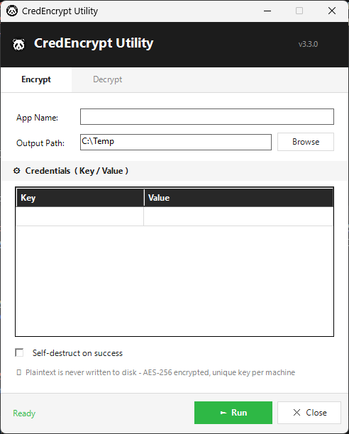
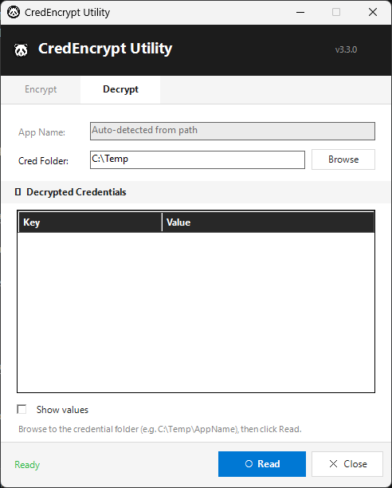

# CredEncrypt-Utility

Run-once credential encryption utility. Generates a unique AES-256 key per
machine and encrypts a set of application credentials into individual files.
Designed for SCCM deployment as a pre-requisite to dependent applications.
Also supports an interactive GUI mode and a built-in decrypt/read function.

---

## Overview

CredEncrypt-Utility solves the problem of storing API credentials securely on
managed machines without embedding plaintext in scripts or Group Policy.

Each machine generates its own random AES-256 key at runtime. Credentials are
encrypted with that key and stored as individual files. Because every machine
has a different key, compromising one machine reveals nothing about any other.

Plaintext credential values are passed as runtime parameters only - they are
never written to disk at any point.

**Double-click the script** to launch the GUI. Pass `-AppName` and `-Credentials`
on the command line for unattended/SCCM deployment.

---

## Requirements

- PowerShell 5.1 or PowerShell 7+
- Write access to the output path (default `C:\Temp`; runs as SYSTEM via SCCM)
- .NET / WinForms available (GUI mode only - present on all supported Windows versions)

---

## Screenshots

### Encrypt


### Decrypt


---

## Parameters

| Parameter       | Required       | Default    | Description                                                                    |
|-----------------|----------------|------------|--------------------------------------------------------------------------------|
| `-AppName`      | CLI only       | —          | Application name - drives all output folder names and filenames                |
| `-Credentials`  | CLI (encrypt)  | —          | Hashtable of credential name/value pairs to encrypt                            |
| `-BasePath`     | No             | `C:\Temp`  | Base output directory - a subfolder named after `-AppName` is created inside   |
| `-SelfDestruct` | No             | *(off)*    | Pass this switch to delete the script after successful encryption              |
| `-Decrypt`      | No             | *(off)*    | Pass this switch to read and display existing encrypted credentials (CLI mode) |

`-AppName` drives all output paths and filenames automatically:

```
C:\Temp\AppName\K_AppName.txt
C:\Temp\AppName\C_AppNameClientSecret.txt
C:\Temp\AppName\C_AppNameUsername.txt
```

> **Note:** Omitting `-AppName` launches GUI mode. The script never self-destructs
> by default - pass `-SelfDestruct` explicitly for production SCCM deployments.

---

## GUI Mode

Double-clicking the script (or running it with no arguments) opens the
PandaTools-styled GUI. No parameters are required.

### Encrypt tab



- Enter the App Name and output path (Browse button available)
- Add credential key/value pairs in the grid
- Optionally check Self-destruct on success
- Click **Run**

### Decrypt tab



- Browse to the credential folder (e.g. `C:\Temp\Panopto`)
- App Name is auto-detected from the key file in that folder
- Click **Read** - results appear in the grid masked as bullets by default
- Check **Show values** to reveal plaintext

---

## CLI Usage

### Encrypt

```powershell
# Basic - script kept after run
.\CredEncrypt-Utility.ps1 -AppName "Panopto" -Credentials @{ ClientSecret="x"; Username="y"; Password="z" } -BasePath "C:\Windows\Build"

# Custom output path
.\CredEncrypt-Utility.ps1 -AppName "MyApp" -Credentials @{ ApiKey="x"; TenantId="y" } -BasePath "C:\Windows\Build"

# Production SCCM deployment - script deletes itself on success
.\CredEncrypt-Utility.ps1 -AppName "MyApp" -Credentials @{ ApiKey="x" } -SelfDestruct
```

### Decrypt / Read

```powershell
# Point -BasePath at the credential folder directly (the app subfolder, not the parent)
.\CredEncrypt-Utility.ps1 -Decrypt -BasePath "C:\Temp\Panopto"
```

Output:

```
CredEncrypt - Reading credentials from: C:\Windows\Build\Panopto
App: Panopto

  ClientSecret         : xxxxxxxxxxxxxxx
  Username             : abc@somedomain.co.uk
```

### SCCM Program Command Line

```
powershell.exe -ExecutionPolicy Bypass -File ".\CredEncrypt-Utility.ps1" -AppName "Panopto" -Credentials @{ ClientSecret="x"; Username="y"; Password="z" } -SelfDestruct
```

---

## Output Files

All files are written to `<BasePath>\<AppName>\`.

| File                        | Contents                             |
|-----------------------------|--------------------------------------|
| `K_AppName.txt`             | 32-byte AES-256 key (machine-unique) |
| `C_AppNameClientSecret.txt` | Encrypted ClientSecret               |
| `C_AppNameUsername.txt`     | Encrypted Username                   |
| `C_AppNamePassword.txt`     | Encrypted Password                   |

File names are derived from `-AppName` and the keys supplied in `-Credentials`.
Adding a new key to the hashtable automatically creates a new encrypted file
with no script edits required.

---

## Credential Merge Order

Credentials are merged in this order before encryption:

1. `$hardcodedCredentials` - static entries defined inside the script (empty by default)
2. `-Credentials` parameter - runtime values passed at execution

Runtime values take precedence. If the same key appears in both, the runtime
value wins. `$hardcodedCredentials` is intentionally empty in the default
script - populate it only if a credential should be baked in for all
deployments of a given app.

---

## Self-Deletion Behaviour

| Mode                    | Setup succeeds                | Setup fails               |
|-------------------------|-------------------------------|---------------------------|
| Default (no switch)     | Script kept                   | Script kept for diagnosis |
| `-SelfDestruct` passed  | Script deleted after 3s delay | Script kept for diagnosis |

Self-deletion is handled by a hidden `cmd.exe` process with a 3 second timeout
to allow PowerShell to fully exit before the file is removed.

The script **never** self-deletes on failure regardless of mode.

---

## Logging

Every run appends to:

```
<BasePath>\Logs\<AppName>_CredEncrypt-Utility.log
```

Log entries include timestamp, machine name, launch mode (GUI/CLI),
SelfDestruct state, and result for each file written.

---

## When Credentials Change

1. Update `-AppName` and `-Credentials` values in the SCCM program command line
2. Update Distribution Points in SCCM
3. Redeploy - each machine generates a new unique key and overwrites all files